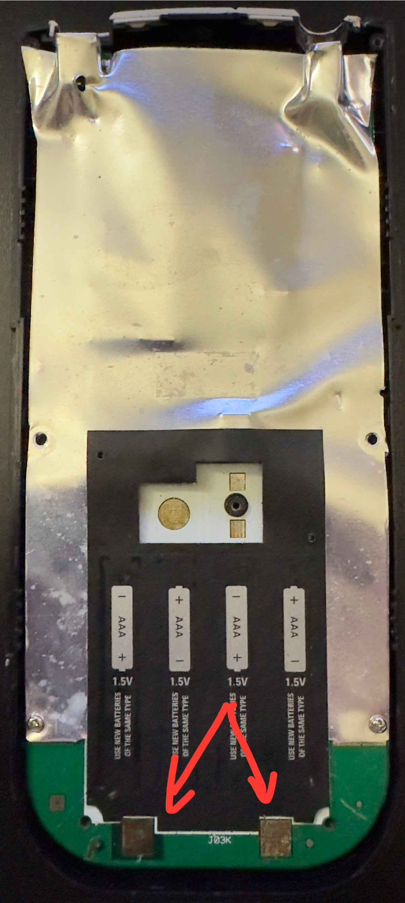

# TI-84 Plus Battry Panel Fix
Revive Your Old TI-84
This guide will help you **revive your old TI-84 calculator**.
⚠️ **Warning:** This tutorial requires **soldering skills and specific tools**. If you don’t have these tools, check out my [alternative tutorial](#) for a no-soldering method.
## Tools You Will Need

- Torx T6 screwdriver (for the outer screws)  
- Phillips screwdriver (for the backup battery)  
- Soldering iron and solder  
- Optional: tweezers, small pliers, and magnifying glass  

  

## Step 1: Open the Calculator

1. Use the **Torx T6 screwdriver** to remove the outer screws.  
2. Carefully lift the back cover.  
3. Use the **Phillips screwdriver** to remove the screw holding the backup battery in place.

  

## Step 2: Inspect and Clean (Example)

1. Check for dust, corrosion, or loose components.  
2. Use a small brush or compressed air to clean the inside.  
3. Make note of any damaged components that might need replacing.

  

## Step 3: Cleaning Copper Pads
1) Gather your materials:
-Isopropyl alcohol (90% or higher)
-Cotton swabs or a soft, lint-free cloth
-Soft-bristled brush (optional, like a toothbrush)

2) Remove loose debris: Gently brush the pad to remove dust or dirt.
3) Clean with alcohol: Dampen a cotton swab or cloth with isopropyl alcohol and rub the copper pad gently.
4) Remove oxidation (optional): Lightly rub the pad with a clean pencil eraser if tarnished, then brush off residue.
5) Final wipe: Use a dry swab or cloth to ensure the pad is clean and shiny.

**Tips:**
-Avoid applying too much pressure; the pad can lift if scratched.
-Make sure the pad is completely dry before moving to soldering.
-Work in a well-lit area to clearly see the copper surface.

  

## Step 4: Soldering

⚠️ **Warning:** Soldering irons get very hot. Handle with care.  

1. Set your soldering iron to **350°C (662°F)**.  
2. Apply **flux** to the copper pads before soldering.  
3. Place the iron tip on the pad for **about 4 seconds**.  
4. Deposit solder onto the pad while the iron is in place.  
5. Remove the iron and let the solder **cool naturally**.  

**Tips:**  
- Avoid touching the tip or molten solder.  
- Work in a well-ventilated area.  
- Do not overheat the pads; this can damage the board.

  

  

## Step 5: Reassembling the Device
🔧 Note: Handle all components gently to avoid damaging pads or connectors.
1. Reattach the back panel: Align it carefully with the edges of the device.
2. Secure with screws: Replace all screws removed earlier and tighten them evenly. Do not overtighten, as this may strip the threads or crack the plastic.
3. Insert the batteries: Place the batteries back into their compartment, ensuring correct orientation (match + and –).
4. Test the device: Power it on to confirm everything works correctly.

**Tips:** 
-Keep a small container for screws to avoid losing them.
-If the device doesn’t power on, double-check battery placement and connections.
-Work on a clean, flat surface to prevent dropping small parts.

  

## Congratulations! Your calculator is repaired.

